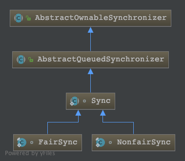
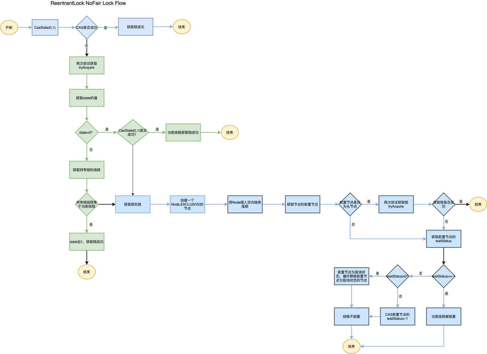

# ReentrantLock

可重入锁，具有排他性。所谓可重入，是指一个线程可以重复获取同一个锁。

## 基本说明
ReentrantLock的实现逻辑主要由其内部类Sync来完成，下图为Sync的类图关系：  

从图中可以看出，ReentrantLock的内部抽象类Sync有两种实现方式，NonFairSync和FairSync，分别对应为非公平锁和公平锁。

AbstractQueuedSynchronizer简称AQS，AQS核心思想是，如果被请求的共享资源空闲，那么就将当前请求资源的线程设置为有效的工作线程，将共享资源设置为锁定状态；如果共享资源被占用，就需要一定的阻塞等待唤醒机制来保证锁分配。
这个机制主要用的是CLH队列的变体实现的，将暂时获取不到锁的线程加入到队列中。
CLH：Craig、Landin and Hagersten队列，是单向链表，AQS中的队列是CLH变体的虚拟双向队列（FIFO），AQS是通过将每条请求共享资源的线程封装成一个节点来实现锁的分配。

## 可重入设计
synchronized关键词是Java隐式锁，也具有可重入性。  
ReentrantLock的可重入性是怎么设计实现的呢？  
关键点在ReentrantLock的内部类Sync的父类AbstractQueuedSynchronizer中的一个变量state，其在AQS中的定义如下：  
> private volatile int state;

volatile关键词是为了保证state的可见性。  
state的初始值为0，当一个线程获取ReentrantLock锁成功后state会加一，可重入的情况是一个线程多次获取锁时state会逐次加一。

## 非公平锁
ReentrantLock的默认实现是非公平锁。下图为ReentrantLock加锁的流程图，

## 公平锁

